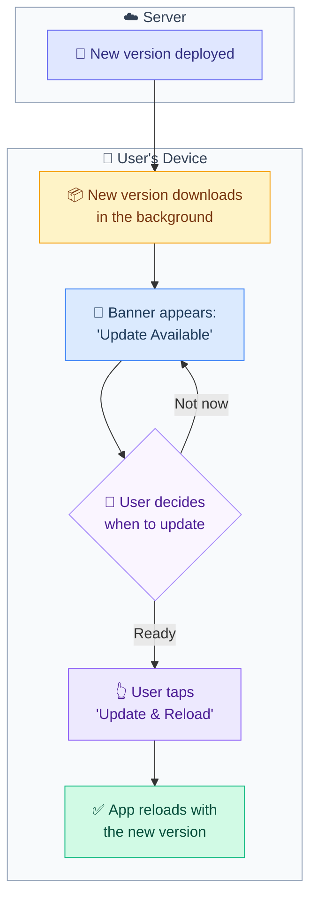
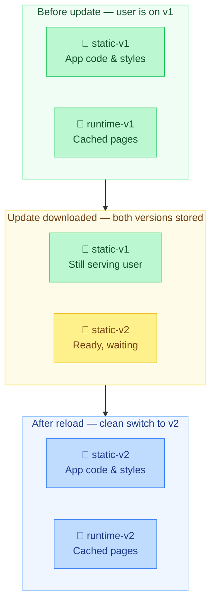
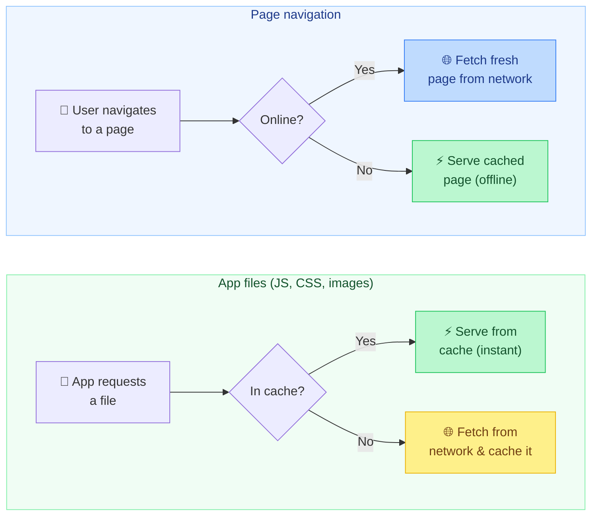

# Architecture

## Overview

Hungry Hundreds is a habit-tracking PWA with an animated monster companion that evolves based on streak consistency. This document outlines the system architecture, tech stack, and key design patterns.

## Tech Stack

| Layer               | Technology               | Purpose                              |
| ------------------- | ------------------------ | ------------------------------------ |
| Framework           | SvelteKit (SPA mode)     | 15KB core, compiles to vanilla JS    |
| Character Animation | Rive                     | State machines for monster evolution |
| UI Animation        | Motion One               | 2.6KB micro-interactions             |
| Offline Storage     | Dexie.js                 | IndexedDB wrapper (29KB)             |
| Backend             | Supabase                 | PostgreSQL + Auth + Edge Functions   |
| Push Notifications  | Firebase Cloud Messaging | Cross-platform delivery              |
| Hosting             | Cloudflare Pages         | 300+ edges, $0 bandwidth             |

**Performance Targets:** Bundle <75KB | Load <2.5s on 3G | 100% offline reliability

### Frontend Framework

- **SvelteKit 2.x** - Full-stack framework with file-based routing (SPA mode)
- **Svelte 5.x** - Component framework with runes-based reactivity
- **TypeScript** - Type safety and enhanced developer experience

### Animation

- **Rive (@rive-app/canvas)** - Monster character animations with state machines
- **Motion** - Lightweight micro-interactions and UI feedback (2.6KB)

### Offline Storage

- **Dexie.js** - IndexedDB wrapper for local-first data persistence
- **Service Worker** - Cache-first asset loading, network-first API calls

### Backend Services

- **Supabase** - PostgreSQL database with Row Level Security
- **Supabase Auth** - User authentication and session management
- **Supabase Edge Functions** - Serverless API endpoints (Deno runtime)
- **Firebase Cloud Messaging** - Push notifications for reminders

### Styling

- **Tailwind CSS 4.x** - Utility-first CSS framework with Vite plugin
- **Custom Design System** - Hungry-themed color palette and component classes
- **Google Fonts** - Fredoka font family for playful typography

### Deployment

- **Cloudflare Pages** - Edge deployment platform (300+ edges)
- **@sveltejs/adapter-cloudflare** - SvelteKit adapter for Cloudflare Workers
- **Wrangler** - Cloudflare development and deployment CLI

### Development Tools

- **Vite 7.x** - Build tool and dev server
- **Vitest** - Unit testing framework
- **Playwright** - End-to-end testing
- **ESLint + Prettier** - Code quality and formatting

## Project Structure

```
hungryhundreds/
├── src/
│   ├── app.html
│   ├── routes/
│   │   ├── +page.svelte              # Home (today's habits)
│   │   ├── +layout.svelte            # App shell
│   │   ├── chat/+page.svelte         # Full-screen chat with Gonn
│   │   ├── habits/+page.svelte       # Habit list
│   │   ├── habits/[id]/+page.svelte  # Habit detail + completion history
│   │   ├── habits/new/+page.svelte   # Create habit
│   │   ├── journey/+page.svelte      # Analytics / history
│   │   ├── onboard/+page.svelte      # First-time setup
│   │   └── settings/+page.svelte     # User preferences
│   ├── lib/
│   │   ├── ai/                     # Gonn dialogue, memory, and rule engine
│   │   ├── components/             # Reusable Svelte components
│   │   ├── db/                     # Dexie schema + habit/log data access
│   │   ├── history/                # Derived habit-history helpers
│   │   ├── stores/                 # Svelte 5 runes stores
│   │   ├── supabase/               # Auth + API client
│   │   └── sync/                   # Offline sync logic
│   └── service-worker.ts
├── static/
│   ├── manifest.json
│   ├── icon-192.png
│   ├── icon-512.png
│   └── animations/
│       └── monster_hatchling.riv  # Rive file with CharacterVM view model
├── supabase/
│   └── functions/
│       ├── complete-habit/        # Habit completion endpoint
│       └── daily-reminder/        # Push notification cron
├── svelte.config.js
├── vite.config.ts
└── package.json
```

## Design Patterns

### State Management

- **Svelte Stores** - Reactive state management using writable and derived stores
- **Store Location** - `src/lib/stores/` for global application state
- **Dexie.js** - Local IndexedDB storage for offline-first data persistence
- **Sync Queue** - Pending operations stored locally, synced when online

### Offline-First Architecture

- **Local-first Priority** - All operations save to Dexie immediately
- **Background Sync** - SyncQueue processes when connectivity restored
- **Server Authoritative** - Supabase is source of truth on conflicts (last-write-wins)
- **Optimistic UI** - Immediate feedback on user actions

### Component Architecture

- **Atomic Design** - Small, reusable components composed into larger features
- **Props-based API** - Components receive data via props
- **Svelte 5 Runes** - Modern reactivity with `$state`, `$derived`, `$effect`

### Routing

- **File-based Routing** - SvelteKit's convention-based routing in `src/routes/`
- **Layout Hierarchy** - Root layout (`+layout.svelte`) provides app shell
- **Page Components** - `+page.svelte` files define route content

### Styling Strategy

- **Utility-first** - Tailwind CSS utilities for rapid development
- **Component Classes** - Custom classes in `app.css` for common patterns
- **Dynamic Colors** - Habit colors applied via inline styles

## Data Models

### Local Storage (Dexie.js)

```typescript
// src/lib/db.ts
interface Habit {
  id?: number;
  serverId?: string;        // Supabase UUID after sync
  name: string;
  color: string;            // Hex color
  reminderTime?: string;    // HH:MM format
  createdAt: number;        // Unix timestamp
  updatedAt: number;
}

interface HabitLog {
  id?: number;
  serverId?: string;
  habitId: number;
  date: string;             // YYYY-MM-DD
  completedAt: number;      // Unix timestamp
  synced: boolean;
}

interface SyncQueue {
  id?: number;
  action: 'create' | 'update' | 'delete';
  table: 'habits' | 'logs';
  payload: any;
  timestamp: number;
  retries: number;
}
```

### Gonn Evolution & Rule Engine

Evolution is driven by a **satiation model** (feeding + exponential decay), not streak days. Five stages: Egg → Hatchling → Juvenile → Adult → Apex, with hysteresis thresholds to prevent flickering. Rive inputs are driven by `MascotState`, produced by `deriveMascotState()`.

See **[RULE_ENGINE_SPEC.md](./RULE_ENGINE_SPEC.md)** for all data models, stage thresholds, decay formulas, mood engine logic, and Rive input definitions.

## Key Technical Decisions

### Why SvelteKit?

- **Performance** - 15KB core, minimal runtime overhead
- **Developer Experience** - Simple syntax, less boilerplate than React/Vue
- **SPA Mode** - Optimized for PWA with client-side routing
- **Edge Deployment** - Native Cloudflare Workers support

### Why Supabase?

- **PostgreSQL** - Robust relational database with Row Level Security
- **Built-in Auth** - User authentication out of the box
- **Edge Functions** - Serverless Deno functions for API logic
- **Realtime** - Future capability for sync across devices

### Why Dexie.js?

- **IndexedDB Wrapper** - Simple API for complex IndexedDB operations
- **29KB Bundle** - Lightweight for PWA constraints
- **Offline-First** - Critical for 100% offline reliability target
- **Reactive Queries** - Works well with Svelte stores

### Why Rive?

- **State Machines** - Complex character animations with triggers
- **Small Files** - Efficient animation format for mobile
- **Runtime Control** - Dynamic evolution stages based on streaks

### Why Cloudflare?

- **Edge Performance** - 300+ global CDN locations
- **Free Tier** - $0 bandwidth for static assets
- **Fast Deploys** - Instant global propagation

## Data Flow

### Habit Completion Flow

```
1. User taps "Done" on habit
2. UI: Button springs (Motion One)
3. Local: Insert log into Dexie, update streak store
4. Monster: Trigger happy animation, check evolution
5. Background: Add to syncQueue if offline, else POST to Supabase
6. Server: Insert log, return canonical streak
7. Reconcile: If server streak differs, update local
```

### Offline Sync Strategy

```
Priority: Local-first, server-authoritative

On action (create/update/delete):
  1. Apply to Dexie immediately
  2. Add to syncQueue with timestamp

On connectivity restored:
  1. Process syncQueue oldest-first
  2. For each item:
     - POST to Supabase
     - On success: remove from queue, update serverId
     - On conflict (409): fetch server state, merge (last-write-wins)
     - On failure: increment retries, retry with backoff (max 5)
  3. After queue empty: full sync (GET all user data since lastSync)
```

## Core Features

### 1. Habit Management

- Create/edit/delete habits with name, color, reminder time
- Maximum 10 habits per user (MVP)
- Soft delete with 30-day recovery window

### 2. Daily Check-in

- Tap to mark habit complete for today
- Visual feedback: button spring animation (Motion One)
- Immediate local save (Dexie), background sync (Supabase)
- Cannot complete future dates; can backfill past 7 days

### 3. Streak Tracking

- Current streak and best streak support daily, weekly, and `every-x-days` cadences
- Interval habits snapshot `windowIntervalDays` on each completion so past windows stay governed by the rule active at the time
- Mid-window interval edits can defer through `pendingIntervalDays` and apply after the next completion
- Streaks and per-habit completion history are derived locally first, server authoritative on sync

### 4. Push Notifications

- Daily reminder at user-configured time
- Streak milestone celebrations (7, 30, 100 days)
- Re-engagement after 3 days inactive

## Performance Budgets

| Metric        | Target          | Measurement                                   |
| ------------- | --------------- | --------------------------------------------- |
| Bundle (gzip) | <75KB           | `pnpm build && ls -la .svelte-kit/cloudflare` |
| LCP           | <2.5s           | Lighthouse on 3G throttle                     |
| FID           | <100ms          | Lighthouse                                    |
| CLS           | <0.1            | Lighthouse                                    |
| Offline       | 100% functional | Manual test: airplane mode                    |

## Service Worker

The service worker (`src/service-worker.ts`) provides:

- **Install**: Cache app shell assets into a versioned `static-{version}` cache. Does **not** call `skipWaiting()` — the new SW enters the "waiting" state so the app can detect it and prompt the user.
- **Activate**: Clean old `static-*` and `runtime-cache` caches, then call `clients.claim()`.
- **Fetch**: Cache-first for static assets, network-first for HTML navigation.
- **Push**: Handle push notification display.
- **Notification Click**: Open app to relevant page.
- **Message (`SKIP_WAITING`)**: Triggers `self.skipWaiting()` on demand — sent by `pwaStore.applyUpdate()` when the user confirms an update.

### PWA Update Lifecycle

When a new version is deployed, the app asks the user to reload rather than updating silently. This prevents errors that would occur if the app tried to mix old and new files mid-session — the reload ensures everything switches over cleanly at once.



#### Why not update automatically?

The app stores two sets of files on the device so it works offline:

- **App files** — the JavaScript, CSS, and images that make the app run (stored in a `static` cache)
- **Cached pages** — pages you've visited before, saved for offline use (stored in a `runtime` cache)

Both caches are tagged with a version number. When a new version is deployed, the new files are downloaded in the background but **not activated yet** — the user is still running the old version. If the app silently swapped to the new files mid-session, the old page would try to load new files it doesn't recognise, causing errors. The reload ensures the old page is discarded and everything starts fresh with the new version.



#### How offline caching works

App files and page navigations use different caching strategies to balance speed and freshness:



Key files:

- `src/service-worker.ts` — SW lifecycle; caching strategies; handles `SKIP_WAITING` message
- `src/lib/stores/pwa.ts` — `updateAvailable` state, `_detectUpdates()`, `applyUpdate()`
- `src/lib/components/UpdatePrompt.svelte` — Toast banner rendered in root layout

## Related Documentation

- [RULE_ENGINE_SPEC.md](./RULE_ENGINE_SPEC.md) - Gonn behavior, evolution, and mood engine
- [DEVELOPMENT.md](./DEVELOPMENT.md) - Setup and development workflow
- [API.md](./API.md) - Data models and Supabase endpoints
- [DEPLOYMENT.md](./DEPLOYMENT.md) - Cloudflare deployment process
