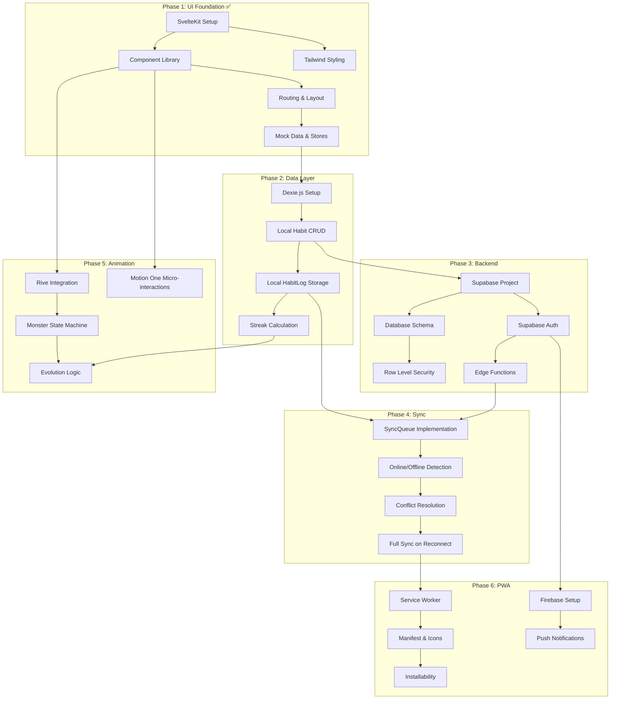

# Hungry Hundreds - Development Roadmap

This document tracks the phased development of Hungry Hundreds, from UI foundation to full PWA with offline sync and animations.

## Overview

| Phase | Name          | Description                                        | Status      |
| ----- | ------------- | -------------------------------------------------- | ----------- |
| 1     | UI Foundation | SvelteKit, components, routing, mock data          | ✅ Complete |
| 2     | Data Layer    | Dexie.js, local persistence, CRUD operations       | ✅ Complete |
| 3     | Backend       | Supabase, auth, database, Edge Functions           | ✅ Complete |
| 4     | Sync          | Offline queue, conflict resolution, reconnect      | 📋 Planned  |
| 5     | Animation     | Rive integration, monster evolution, Motion One    | 📋 Planned  |
| 6     | PWA           | Service worker, push notifications, installability | 📋 Planned  |

---

## Phase 1: UI Foundation ✅

**Goal:** Establish the visual foundation and user experience with mock data.

| Task                       | Status | Notes                                |
| -------------------------- | ------ | ------------------------------------ |
| SvelteKit project setup    | ✅     | Cloudflare adapter configured        |
| Tailwind CSS 4 integration | ✅     | Dark theme, Fredoka font             |
| Component library          | ✅     | HabitCard, Header, BottomNav, etc.   |
| File-based routing         | ✅     | Home, habits/, dashboard/, settings/ |
| Mock data and stores       | ✅     | Svelte 5 runes with derived state    |

**Deliverables:**

- ✅ Functional UI with all core screens
- ✅ Responsive mobile-first design
- ✅ Component documentation

---

## Phase 2: Data Layer ✅

**Goal:** Replace mock data with persistent local storage using Dexie.js.

| Task                         | Status | Dependencies           | Effort |
| ---------------------------- | ------ | ---------------------- | ------ |
| Install Dexie.js             | ✅     | Phase 1 complete       | S      |
| Create db.ts schema          | ✅     | Dexie installed        | M      |
| Migrate habitStore           | ✅     | db.ts created          | M      |
| Migrate habitLogStore        | ✅     | db.ts created          | M      |
| Implement streak calculation | ✅     | habitLogStore migrated | M      |

**Key Files to Create:**

```
src/lib/db/
├── db.ts           # Dexie database instance
├── habits.ts       # Habit CRUD operations
└── habitLogs.ts    # HabitLog operations
```

**Acceptance Criteria:**

- [ ] Data persists across browser refreshes
- [ ] CRUD operations work without network
- [ ] Streak calculation is accurate
- [ ] Migration from mock data is seamless

---

## Phase 3: Backend ✅

**Goal:** Set up Supabase for authentication and cloud data storage.

| Task                    | Status | Dependencies      | Effort |
| ----------------------- | ------ | ----------------- | ------ |
| Install Supabase client | ✅     | None              | S      |
| Create client module    | ✅     | Package installed | S      |
| Create TypeScript types | ✅     | Client created    | M      |
| Create auth helpers     | ✅     | Types defined     | M      |
| Create auth store       | ✅     | Auth helpers      | M      |
| Create SQL migration    | ✅     | Types defined     | M      |
| Create API wrapper      | ✅     | Types defined     | M      |

**Key Files Created:**

```
src/lib/supabase/
├── client.ts       # Supabase client instance ✅
├── types.ts        # TypeScript database types ✅
├── auth.ts         # Authentication helpers ✅
├── api.ts          # API wrapper functions ✅
└── index.ts        # Module exports ✅

src/lib/stores/
└── auth.ts         # Reactive auth store ✅

supabase/migrations/
└── 20260115_initial_schema.sql  # Database schema ✅
```

**Acceptance Criteria:**

- [x] Supabase client configured with types
- [x] Auth helpers for sign up/in/out
- [x] Reactive auth store for UI
- [x] SQL migration ready to deploy
- [ ] Supabase project created (user action required)
- [ ] Edge Functions (Phase 4+)

---

## Phase 4: Sync 📋

**Goal:** Implement offline-first sync between Dexie and Supabase.

| Task                      | Status | Dependencies      | Effort |
| ------------------------- | ------ | ----------------- | ------ |
| Implement SyncQueue table | 📋     | Phase 2, Phase 3  | M      |
| Online/offline detection  | 📋     | SyncQueue ready   | S      |
| Background sync logic     | 📋     | Detection working | L      |
| Conflict resolution       | 📋     | Sync working      | L      |

**Key Files to Create:**

```
src/lib/sync/
├── queue.ts        # SyncQueue operations
├── detector.ts     # Online/offline detection
├── sync.ts         # Core sync logic
└── conflicts.ts    # Conflict resolution
```

**Acceptance Criteria:**

- [ ] Changes made offline are queued
- [ ] Queue processes when online
- [ ] Conflicts are resolved (last-write-wins)
- [ ] UI shows sync status

---

## Phase 5: Animation 📋

**Goal:** Integrate Rive for monster animations and Motion One for micro-interactions.

| Task                              | Status | Dependencies               | Effort |
| --------------------------------- | ------ | -------------------------- | ------ |
| Install @rive-app/canvas          | 📋     | Phase 1 complete           | S      |
| Create monster.riv asset          | 📋     | Rive installed             | L      |
| Implement Monster component       | 📋     | Asset created              | M      |
| Add evolution logic               | 📋     | Monster component, Phase 2 | M      |
| Add Motion One micro-interactions | 📋     | Phase 1 complete           | M      |

**Key Files to Create:**

```
src/lib/components/
├── Monster.svelte  # Rive canvas wrapper
└── animations/
    └── transitions.ts  # Motion One utilities

static/animations/
└── monster.riv     # Rive animation file
```

**Monster Evolution Stages:**
| Stage | XP Required | State Machine Input |
|-------|-------------|---------------------|
| Egg | 0 | `stage=0` |
| Baby | 100 | `stage=1` |
| Teen | 500 | `stage=2` |
| Adult | 1500 | `stage=3` |
| Elder | 5000 | `stage=4` |

**Acceptance Criteria:**

- [ ] Monster displays with correct evolution stage
- [ ] Feeding animation plays on habit completion
- [ ] Smooth transitions between stages
- [ ] Performs well on mobile (60fps)

---

## Phase 6: PWA 📋

**Goal:** Full PWA functionality with offline support and push notifications.

| Task                            | Status | Dependencies     | Effort |
| ------------------------------- | ------ | ---------------- | ------ |
| Create service worker           | 📋     | Phase 4 complete | M      |
| Create manifest.json            | 📋     | None             | S      |
| Create app icons                | 📋     | None             | S      |
| Set up Firebase Cloud Messaging | 📋     | Phase 3 auth     | M      |
| Implement push notifications    | 📋     | FCM configured   | L      |

**Key Files to Create:**

```
src/service-worker.ts    # SvelteKit service worker
static/manifest.json     # PWA manifest
static/icon-192.png      # App icon
static/icon-512.png      # App icon
src/lib/notifications/
├── firebase.ts          # FCM initialization
└── push.ts              # Push notification handlers
```

**Acceptance Criteria:**

- [ ] App is installable on mobile
- [ ] Works fully offline
- [ ] Push notifications for daily reminders
- [ ] Lighthouse PWA score > 90

---

## Dependency Diagram



---

## Effort Legend

| Size | Meaning     | Approximate Time |
| ---- | ----------- | ---------------- |
| S    | Small       | < 2 hours        |
| M    | Medium      | 2-8 hours        |
| L    | Large       | 1-3 days         |
| XL   | Extra Large | 1+ week          |

---

## Status Legend

| Symbol | Meaning     |
| ------ | ----------- |
| ✅     | Complete    |
| 🚧     | In Progress |
| 📋     | Planned     |
| ⏳     | Blocked     |

---

## Related Documentation

- **[STATUS.md](../STATUS.md)** - Quick implementation status (AI agents read first)
- **[TECH_SPEC.md](./TECH_SPEC.md)** - Full technical specification
- **[ARCHITECTURE.md](./ARCHITECTURE.md)** - System architecture
- **[API.md](./API.md)** - Data models and endpoints
