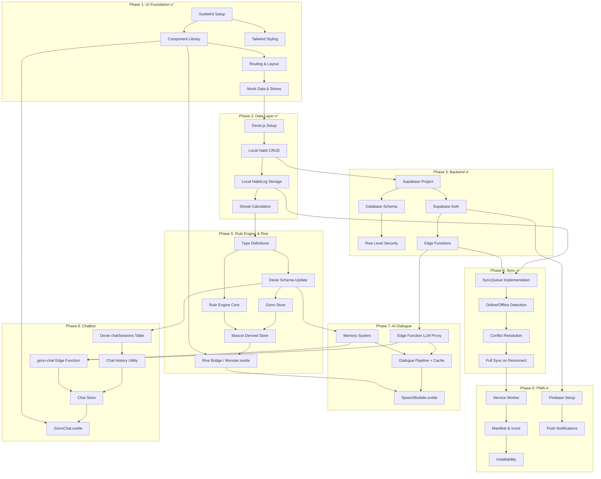

# Hungry Hundreds - Development Roadmap

This document tracks the phased development of Hungry Hundreds, from UI foundation to full PWA with offline sync and animations.

## Overview

| Phase | Name               | Description                                           | Status      |
| ----- | ------------------ | ----------------------------------------------------- | ----------- |
| 1     | UI Foundation      | SvelteKit, components, routing, mock data             | ✅ Complete |
| 2     | Data Layer         | Dexie.js, local persistence, CRUD operations          | ✅ Complete |
| 3     | Backend            | Supabase, auth, database, Edge Functions              | ✅ Complete |
| 4     | Sync               | Offline queue, conflict resolution, reconnect         | ✅ Complete |
| 5     | Rule Engine & Rive | Rule engine, mascot stores, Rive bridge, Dexie schema | 📋 Planned  |
| 6     | PWA                | Service worker, push notifications, installability    | ✅ Complete |
| 7     | AI Dialogue        | LLM proxy, memory system, speech bubble, Motion One   | 📋 Planned  |
| 8     | Chatbot            | Interactive multi-turn chat with Gonn, streaming SSE  | 📋 Planned  |

---

## Phase 1: UI Foundation ✅

**Goal:** Establish the visual foundation and user experience with mock data.

| Task                       | Status | Notes                                      |
| -------------------------- | ------ | ------------------------------------------ |
| SvelteKit project setup    | ✅     | Cloudflare adapter configured              |
| Tailwind CSS 4 integration | ✅     | Dark theme, Fredoka font                   |
| Component library          | ✅     | HabitCard, Header, Toast, drawer nav, etc. |
| File-based routing         | ✅     | Home, habits/, journey/, chat/, settings/  |
| Mock data and stores       | ✅     | Svelte 5 runes with derived state          |

**Deliverables:**

- ✅ Functional UI with all core screens
- ✅ Responsive mobile-first design
- ✅ Component documentation

---

## Phase 2: Data Layer ✅

**Goal:** Replace mock data with persistent local storage using Dexie.js.

| Task                         | Status | Dependencies           | Effort |
| ---------------------------- | ------ | ---------------------- | ------ |
| Install Dexie.js             | ✅     | Phase 1 complete       | S      |
| Create db.ts schema          | ✅     | Dexie installed        | M      |
| Migrate habitStore           | ✅     | db.ts created          | M      |
| Migrate habitLogStore        | ✅     | db.ts created          | M      |
| Implement streak calculation | ✅     | habitLogStore migrated | M      |

**Key Files to Create:**

```
src/lib/db/
├── db.ts           # Dexie database instance
├── habits.ts       # Habit CRUD operations
└── habitLogs.ts    # HabitLog operations
```

**Acceptance Criteria:**

- [ ] Data persists across browser refreshes
- [ ] CRUD operations work without network
- [ ] Streak calculation is accurate
- [ ] Migration from mock data is seamless

---

## Phase 3: Backend ✅

**Goal:** Set up Supabase for authentication and cloud data storage.

| Task                    | Status | Dependencies      | Effort |
| ----------------------- | ------ | ----------------- | ------ |
| Install Supabase client | ✅     | None              | S      |
| Create client module    | ✅     | Package installed | S      |
| Create TypeScript types | ✅     | Client created    | M      |
| Create auth helpers     | ✅     | Types defined     | M      |
| Create auth store       | ✅     | Auth helpers      | M      |
| Create SQL migration    | ✅     | Types defined     | M      |
| Create API wrapper      | ✅     | Types defined     | M      |

**Key Files Created:**

```
src/lib/supabase/
├── client.ts       # Supabase client instance ✅
├── types.ts        # TypeScript database types ✅
├── auth.ts         # Authentication helpers ✅
├── api.ts          # API wrapper functions ✅
└── index.ts        # Module exports ✅

src/lib/stores/
└── auth.ts         # Reactive auth store ✅

supabase/migrations/
└── 20260115_initial_schema.sql  # Database schema ✅
```

**Acceptance Criteria:**

- [x] Supabase client configured with types
- [x] Auth helpers for sign up/in/out
- [x] Reactive auth store for UI
- [x] SQL migration ready to deploy
- [ ] Supabase project created (user action required)
- [ ] Edge Functions (Phase 4+)

---

## Phase 4: Sync ✅

**Goal:** Implement offline-first sync between Dexie and Supabase.

| Task                      | Status | Dependencies      | Effort |
| ------------------------- | ------ | ----------------- | ------ |
| Implement SyncQueue table | ✅     | Phase 2, Phase 3  | M      |
| Online/offline detection  | ✅     | SyncQueue ready   | S      |
| Background sync logic     | ✅     | Detection working | L      |
| Conflict resolution       | ✅     | Sync working      | L      |

**Key Files Created:**

```
src/lib/sync/
├── queue.ts        # SyncQueue operations ✅
├── detector.ts     # Online/offline detection ✅
├── sync.ts         # Core sync logic ✅
├── conflicts.ts    # Conflict resolution ✅
└── index.ts        # Module exports ✅
```

**Acceptance Criteria:**

- [x] Changes made offline are queued
- [x] Queue processes when online
- [x] Conflicts are resolved (last-write-wins)
- [x] UI shows sync status (via syncStatusText store)

---

## Phase 5: Rule Engine & Rive 📋

**Goal:** Implement the deterministic rule engine, Gonn state management, and Rive animation bridge. This phase makes Gonn react to habit data in real-time without any LLM dependency.

| Task                             | Status | Dependencies             | Effort |
| -------------------------------- | ------ | ------------------------ | ------ |
| Create type definitions          | 📋     | Phase 2 complete         | S      |
| Implement rule engine core       | 📋     | Types defined            | M      |
| Update Dexie schema              | 📋     | Types defined            | S      |
| Create Gonn store (Dexie-backed) | 📋     | Schema updated           | M      |
| Create Mascot derived store      | 📋     | Rule engine, Gonn store  | M      |
| Extend Monster.svelte (Rive)     | 📋     | Mascot store, .riv asset | L      |

**Key Files to Create/Modify:**

```
src/lib/types/
└── mascot.ts            # HabitSnapshot, GonnState, GlobalSnapshot, MascotState, etc.

src/lib/ai/
└── ruleEngine.ts        # deriveMood(), deriveIntensity(), deriveMascotState()

src/lib/stores/
├── gonn.ts              # GonnState store (Dexie-backed, satiation/decay)
└── mascot.ts            # REWRITE: derived MascotState from GlobalSnapshot

src/lib/db/
└── db.ts                # ADD: gonnState, mascotMemory, dialogueCache tables

src/lib/components/
└── Monster.svelte       # EXTEND: Rive bridge with emotion/intensity/evolveNow inputs

static/animations/
└── gonn.riv             # Rive animation file (external asset)
```

**Evolution Stages (Satiation-Based, with Hysteresis):**

| Stage         | Enter At       | Exit At        | Form                           |
| ------------- | -------------- | -------------- | ------------------------------ |
| 1 — Egg       | default        | —              | Small, round, mostly face/eyes |
| 2 — Hatchling | satiation ≥ 10 | satiation < 6  | Eyes open, wiggling            |
| 3 — Juvenile  | satiation ≥ 25 | satiation < 18 | Limbs visible, teeth emerge    |
| 4 — Adult     | satiation ≥ 50 | satiation < 40 | Full body, horns, attitude     |
| 5 — Apex      | satiation ≥ 80 | satiation < 70 | Full kaiju, tail, special FX   |

MVP targets stages 1–3 only.

**Acceptance Criteria:**

- [ ] Rule engine produces correct MascotState from habit data (unit tested)
- [ ] Satiation feeding and exponential decay work correctly
- [ ] Evolution stage transitions use hysteresis (no flickering)
- [ ] Gonn store persists in Dexie, syncs to Supabase
- [ ] Rive inputs update reactively when MascotState changes
- [ ] Rule engine execution < 5ms
- [ ] Monster.svelte falls back to emoji if Rive fails

**Reference:**

- `docs/RULE_ENGINE_SPEC.md` — authoritative formulas
- `docs/features/ai-implementation-spec.md` — implementation guide

---

## Phase 6: PWA ✅

**Goal:** Full PWA functionality with offline support and push notifications.

| Task                            | Status | Dependencies     | Effort |
| ------------------------------- | ------ | ---------------- | ------ |
| Create service worker           | ✅     | Phase 4 complete | M      |
| Create manifest.json            | ✅     | None             | S      |
| Create app icons                | ✅     | None             | S      |
| Set up Firebase Cloud Messaging | ✅     | Phase 3 auth     | M      |
| Implement push notifications    | ✅     | FCM configured   | L      |

**Acceptance Criteria:**

- [x] App is installable on mobile
- [x] Works fully offline
- [x] Push notifications for daily reminders
- [x] Service worker with offline caching and background sync

---

## Phase 7: AI Dialogue 📋

**Goal:** Add LLM-powered dialogue for Gonn via Supabase Edge Functions, with a memory system and speech bubble UI.

| Task                          | Status | Dependencies          | Effort |
| ----------------------------- | ------ | --------------------- | ------ |
| Implement memory system       | 📋     | Phase 5 Dexie schema  | M      |
| Create Supabase Edge Function | 📋     | Supabase project      | M      |
| Implement dialogue pipeline   | 📋     | Edge function, memory | M      |
| Create SpeechBubble.svelte    | 📋     | Dialogue pipeline     | M      |

**Key Files Created:**

```
src/lib/ai/
├── memory.ts            # Memory read/write/trim
└── dialogue.ts          # LLM dialogue pipeline + caching

src/lib/components/
└── SpeechBubble.svelte  # Typewriter speech bubble

supabase/functions/
└── gonn-dialogue/
    └── index.ts         # Edge function LLM proxy
```

**Acceptance Criteria:**

- [ ] LLM dialogue generates in < 2s (async, non-blocking)
- [ ] Dialogue cache hit rate > 50% (4-hour expiry)
- [ ] Memory system stores permanent + short-term memories
- [ ] SpeechBubble shows typewriter text with auto-dismiss
- [ ] Offline: animations + rule engine work fully, dialogue hidden
- [ ] Max 160 characters per dialogue line
- [ ] Gonn personality consistent across evolution stages

**Reference:**

- `docs/features/ai-implementation-spec.md` — full implementation guide

---

## Phase 8: Chatbot 📋

**Goal:** Add an interactive, multi-turn chat interface where users can talk directly to Gonn with full habit context, streaming responses, and session persistence.

**Dependencies:** Phase 5 (Rule Engine & Rive) and Phase 7 (AI Dialogue) must be complete.

| Task                         | Status | Dependencies                  | Effort |
| ---------------------------- | ------ | ----------------------------- | ------ |
| Dexie schema: `chatSessions` | 📋     | Phase 5 Dexie schema          | S      |
| Chat history utility         | 📋     | Types defined                 | S      |
| `gonn-chat` Edge Function    | 📋     | Phase 7 Edge Function pattern | M      |
| Chat store (Svelte 5 runes)  | 📋     | History util, Edge Function   | M      |
| GonnChat.svelte component    | 📋     | Chat store                    | M      |

**Key Files to Create/Modify:**

```
src/lib/
├── ai/
│   └── chatHistory.ts          # trimHistory(), summariseTurns()
├── stores/
│   └── chat.ts                 # chatStore — Svelte 5 runes, SSE streaming
├── components/
│   └── GonnChat.svelte         # Chat panel UI, suggestions, streaming renderer
└── types/
    └── mascot.ts               # EXTEND — add ChatMessage, ChatSession interfaces

src/lib/db/
└── db.ts                       # ADD: chatSessions table, increment version

supabase/functions/
└── gonn-chat/
    └── index.ts                # Streaming edge function with auth + rate limiting
```

**Acceptance Criteria:**

- [ ] Chat streams token-by-token via SSE
- [ ] Session persists across app restarts via Dexie
- [ ] Sliding window (10 turns) with summary compression for older turns
- [ ] Gonn references specific habit names, streaks, and danger zones during chat
- [ ] Auth-gated: unauthenticated requests rejected with 401
- [ ] Rate limited: max 20 messages per user per hour
- [ ] Svelte 5 runes used throughout (no `writable`/`get`)
- [ ] Works when Phase 7 SpeechBubble is also active (no conflicts)
- [ ] Graceful offline handling: error message shown, no crash

**Reference:**

- `docs/features/chatbot-spec.md` — full implementation spec

---

## Dependency Diagram


```mermaid
flowchart TD
    subgraph Phase1["Phase 1: UI Foundation ✅"]
        P1A[SvelteKit Setup]
        P1B[Component Library]
        P1C[Routing & Layout]
        P1D[Mock Data & Stores]
        P1E[Tailwind Styling]
    end

    subgraph Phase2["Phase 2: Data Layer ✅"]
        P2A[Dexie.js Setup]
        P2B[Local Habit CRUD]
        P2C[Local HabitLog Storage]
        P2D[Streak Calculation]
    end

    subgraph Phase3["Phase 3: Backend ✅"]
        P3A[Supabase Project]
        P3B[Database Schema]
        P3C[Row Level Security]
        P3D[Supabase Auth]
        P3E[Edge Functions]
    end

    subgraph Phase4["Phase 4: Sync ✅"]
        P4A[SyncQueue Implementation]
        P4B[Online/Offline Detection]
        P4C[Conflict Resolution]
        P4D[Full Sync on Reconnect]
    end

    subgraph Phase5["Phase 5: Rule Engine & Rive"]
        P5A[Type Definitions]
        P5B[Rule Engine Core]
        P5C[Dexie Schema Update]
        P5D[Gonn Store]
        P5E[Mascot Derived Store]
        P5F[Rive Bridge / Monster.svelte]
    end

    subgraph Phase6["Phase 6: PWA ✅"]
        P6A[Service Worker]
        P6B[Manifest & Icons]
        P6C[Firebase Setup]
        P6D[Push Notifications]
        P6E[Installability]
    end

    subgraph Phase7["Phase 7: AI Dialogue"]
        P7A[Memory System]
        P7B[Edge Function LLM Proxy]
        P7C[Dialogue Pipeline + Cache]
        P7D[SpeechBubble.svelte]
    end

    subgraph Phase8["Phase 8: Chatbot"]
        P8A[Dexie chatSessions Table]
        P8B[Chat History Utility]
        P8C[gonn-chat Edge Function]
        P8D[Chat Store]
        P8E[GonnChat.svelte]
    end

    P1A --> P1B --> P1C --> P1D
    P1A --> P1E

    P1D --> P2A --> P2B --> P2C --> P2D

    P2B --> P3A --> P3B --> P3C
    P3A --> P3D --> P3E

    P2C --> P4A
    P3E --> P4A --> P4B --> P4C --> P4D

    P2D --> P5A --> P5B
    P5A --> P5C --> P5D --> P5E
    P5B --> P5E --> P5F
    P1B --> P5F

    P4D --> P6A --> P6B --> P6E
    P3D --> P6C --> P6D

    P5C --> P7A
    P3E --> P7B --> P7C
    P7A --> P7C --> P7D
    P5F --> P7D

    P5C --> P8A --> P8B
    P7B --> P8C
    P7A --> P8C
    P8B --> P8D --> P8E
    P8C --> P8D
    P1B --> P8E
```

---

## Effort Legend

| Size | Meaning     | Approximate Time |
| ---- | ----------- | ---------------- |
| S    | Small       | < 2 hours        |
| M    | Medium      | 2-8 hours        |
| L    | Large       | 1-3 days         |
| XL   | Extra Large | 1+ week          |

---

## Status Legend

| Symbol | Meaning     |
| ------ | ----------- |
| ✅     | Complete    |
| 🚧     | In Progress |
| 📋     | Planned     |
| ⏳     | Blocked     |

---

## Related Documentation

- **[STATUS.md](../STATUS.md)** - Quick implementation status (AI agents read first)

- **[ARCHITECTURE.md](./ARCHITECTURE.md)** - System architecture
- **[API.md](./API.md)** - Data models and endpoints
- **[RULE_ENGINE_SPEC.md](./RULE_ENGINE_SPEC.md)** - Gonn behavior formulas (authoritative)
- **[ai-implementation-spec.md](./features/ai-implementation-spec.md)** - AI companion implementation guide
- **[chatbot-spec.md](./features/chatbot-spec.md)** - Interactive chatbot spec (Phase 8)
